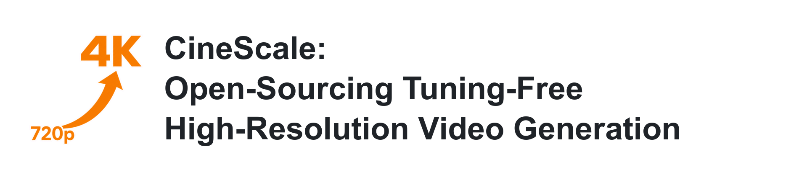
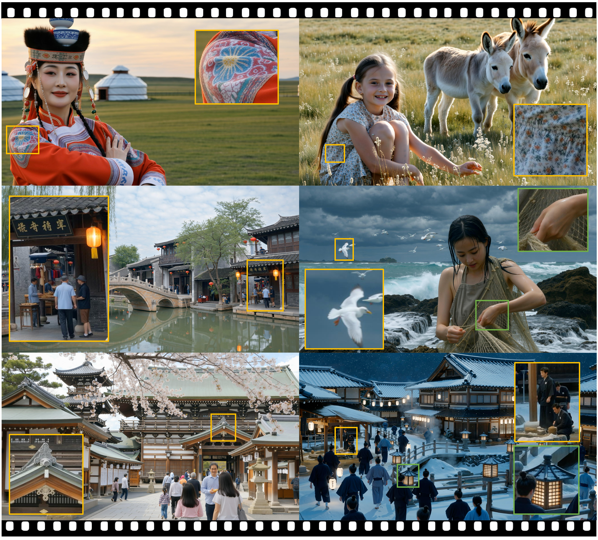
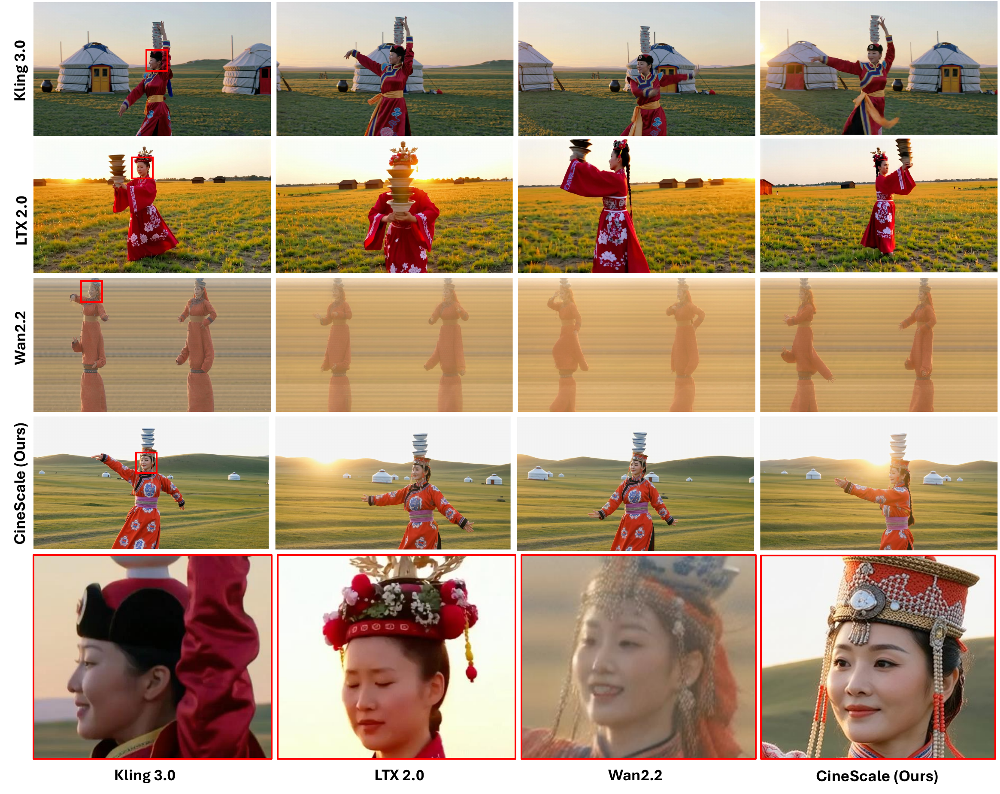

[](https://arxiv.org/abs/2508.15774)
[](https://eyeline-labs.github.io/CineScale/)

> **Note:** This repository is under construction. 


<p align="center">
  <picture>
    <source media="(prefers-color-scheme: dark)" srcset="Figures/CineScale_Header_Dark.png">
    <source media="(prefers-color-scheme: light)" srcset="Figures/CineScale_Header_Light.png">
    
  </picture>
</p>

<p align="center">
  <a href="https://gordonchen19.github.io">Gordon Chen</a><sup>†</sup>,
  <a href="http://haonanqiu.com/">Haonan Qiu</a><sup>†</sup>,
  <a href="https://ningyu1991.github.io/">Ning Yu</a><sup>*</sup>,
  <a href="https://ziqihuangg.github.io">Ziqi Huang</a>,
  <a href="https://www.pauldebevec.com/">Paul Debevec</a>,
  <a href="https://liuziwei7.github.io/">Ziwei Liu</a><sup>*</sup>
</p>

<p align="center">
  <sup>†</sup> Equal contribution &nbsp;&nbsp; <sup>*</sup> Corresponding authors
</p>


<p align="center">From Nanyang Technological University and Netflix Eyeline Studios.</p>


## ⚡ TL;DR

Most video generators are trained at limited spatial resolutions due to the scarcity of high-resolution 4K video data and the prohibitive computational cost of large-scale training on such data. Most video diffusion models are trained on 720p videos and are therefore effectively limited to generating videos at similar resolutions during inference. To address this gap, we propose CineScale. CineScale, to the best of our knowledge, is the first tuning-free inference framework enabling pretrained video diffusion models to generate high-fidelity videos at resolutions far beyond those encountered during training, without any fine-tuning.

CineScale unlocks tuning-free 4K video generation ([Watch our Video Demo here](https://eyeline-labs.github.io/CineScale/))!

## 🎬 Qualitative Results

<p align="center">
  
</p>

<p align="center"><em>Qualitative 4K video generation results produced by CineScale.</em></p>

<p align="center">
  
</p>

<p align="center"><em>Qualitative comparison with existing video generation models.</em></p>


## 📊 Quantitative Results

CineScale substantially improves perceptual quality at high resolution, with
the strongest gains in aesthetic and imaging quality. Subject consistency,
background consistency, and motion smoothness remain comparable to the base
model because CineScale focuses on recovering fine-grained spatial details
while preserving the temporal behavior and semantic structure established by
the low-resolution generation.

**VBench results across target resolutions (higher is better):**

| Resolution | Method | Subject Consistency | Background Consistency | Motion Smoothness | Aesthetic Quality | Imaging Quality |
|---|---|---:|---:|---:|---:|---:|
| 1088 x 1920 | LTX (2B) | 0.935 | 0.951 | 0.989 | 0.607 | 0.668 |
| 1088 x 1920 | Wan-DI | 0.935 | **0.975** | 0.989 | 0.641 | 0.598 |
| 1088 x 1920 | SeedVR2 (3B) | **0.966** | 0.971 | **0.990** | 0.676 | 0.683 |
| 1088 x 1920 | **CineScale (1.3B)** | 0.937 | 0.974 | **0.990** | **0.679** | **0.724** |
| 1920 x 3328 | LTX (2B) | - | 0.975 | - | 0.299 | 0.302 |
| 1920 x 3328 | Wan-DI | - | **0.978** | - | 0.319 | 0.314 |
| 1920 x 3328 | Upscale-A-Video | - | 0.974 | - | **0.661** | 0.680 |
| 1920 x 3328 | **CineScale (1.3B)** | - | 0.975 | - | 0.659 | **0.726** |
| 1080P | CogVideoX | 0.946 | 0.959 | 0.990 | 0.514 | 0.577 |
| 1080P | HunyuanVideo | **0.980** | **0.984** | **0.997** | 0.589 | 0.624 |
| 1080P | Wan-DI | 0.977 | 0.976 | **0.997** | 0.432 | 0.453 |
| 1080P | **CineScale (1.3B)** | 0.970 | 0.977 | 0.991 | **0.680** | **0.726** |
| 4K | CogVideoX | 0.947 | 0.958 | 0.990 | 0.507 | 0.571 |
| 4K | HunyuanVideo | **0.996** | **0.997** | **0.998** | 0.397 | 0.440 |
| 4K | Wan-DI | 0.947 | 0.976 | 0.995 | 0.288 | 0.374 |
| 4K | **CineScale (1.3B)** | 0.955 | 0.979 | 0.992 | **0.693** | **0.735** |


## ⚙️ Setup

The setup follows exactly from the original Wan2.2 Repository. (https://github.com/Wan-Video/Wan2.2)


## 💫 Usage

Deffine your prompts in:

```bash
Wan2.2/prompts.json
```

For instance:

```bash
{
    "prompts": [
        "A little girl, lost in the city and separated from her parents in New York's Times Square, looks up. **The camera tilts up**, following her gaze. Starting from the ground, it slowly reveals the massive, glittering, and dizzying skyscrapers and billboards, powerfully emphasizing her smallness and helplessness in a vast world."
    ]   
}
```

and then run:

```bash
CUDA_VISIBLE_DEVICES=0,1,2,3,4 \
PYTORCH_CUDA_ALLOC_CONF=expandable_segments:True \
torchrun --standalone --nproc_per_node=5 CineScale/Wan2.2/cinescale.py \
  --prompts_json CineScale/Wan2.2/prompts_2.json \
  --output_dir CineScale/example_videos \
  --ckpt_dir Wan2.2-T2V-A14B \
  --frame_num 41 \
  --round_noise_steps 25 \
  --ulysses_size 5 \
  --dit_fsdp \
  --t5_cpu \
  --offload_model true 
```

To decode the video, run: 

```bash
PYTORCH_CUDA_ALLOC_CONF=expandable_segments:True \
python CineScale/Wan2.2/cinescale.py \
  --decode_latent path/to/video_latent.pt \
  --ckpt_dir checkpoint/to/model_weights/Wan2.2-T2V-A14B
```


## 🤗 Acknowledgements
This codebase is built on top of the open-source implementation of [Wan2.2](https://github.com/Wan-Video/Wan2.2) repository.

## 📖 Citation
If you find CineScale useful in your research or projects, consider citing our paper:
```bib
@article{qiu2025cinescale,
  title={CineScale: Free Lunch in High-Resolution Cinematic Visual Generation}, 
  author={Gordon Chen and Haonan Qiu and Ning Yu and Ziqi Huang and Paul Debevec and Ziwei Liu},
  journal={arXiv preprint arXiv:2508.15774},
  year={2025}
}
```
